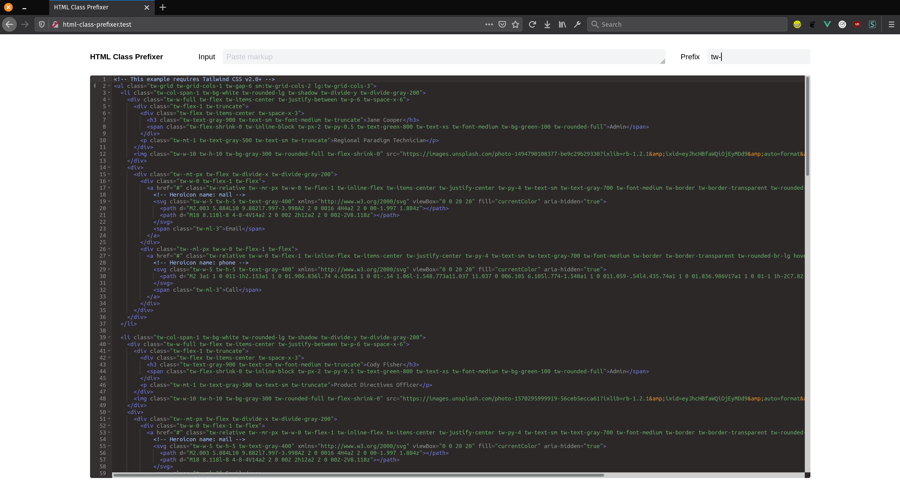

# html-class-prefixer

A Vue app that to apply a prefix to your classes in a piece of markup. Just paste your code and specify a prefix. 



## Project setup
```
yarn install
```

### Compiles and hot-reloads for development
```
yarn serve
```

### Compiles and minifies for production
```
yarn build
```

### Lints and fixes files
```
yarn lint
```

### Customize configuration
See [Configuration Reference](https://cli.vuejs.org/config/).
